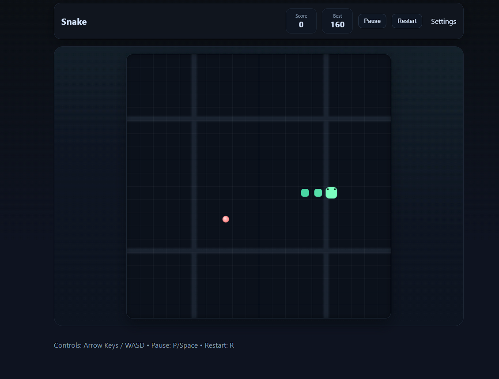

# 🐍 VibraSnek 3000

A modern, slick take on the classic Snake game — built with vanilla HTML5 Canvas, CSS, and JavaScript. Smooth visuals, gradient goodies, keyboard + touch controls, and a persistent best score. Game on! 🎮✨

## 🚀 Features
- 🎯 Score + 🏆 Best score (saved via `localStorage`)
- ⏸️ Pause/Resume overlay with quick restart
- ⚡ Adjustable speed and 🔲 configurable grid size
- ⌨️ Keyboard controls (Arrows / WASD) + 🖐️ Touch D‑Pad
- 🟢 Smooth snake rendering with soft corners and gradients
- 🧱 Clean grid with subtle lighting and depth

## 🕹️ Controls
- Move: Arrow Keys or WASD
- Pause/Resume: `P` or `Space`
- Restart: `R`

On touch devices, use the on‑screen D‑Pad.

## 📦 Getting Started
- Open `snake.html` in your browser.
- That’s it. No build step, no dependencies.

Tip: The game automatically scales the canvas to fit the viewport.

## ⚙️ Settings
Inside the top bar:
- Speed: Drag the slider to change tick rate.
- Grid Size: Choose 16/20/24/28 for smaller or larger cells.

Your best score is stored locally as `snake.best`.

## 🧰 Tech Stack
- HTML5 Canvas for rendering
- Vanilla JavaScript for game loop + state
- Modern CSS for styling and UI polish

## 🗂️ Project Structure
- `snake.html` — App shell and UI
- `snake.css` — Styling, layout, overlays, and D‑Pad
- `snake.js` — Game engine, rendering, input, and state

## 📸 Screenshot

## ✅ Accessibility Notes
- Canvas labeled with `aria-label` and uses an overlay for pause/game over.
- Buttons have proper labels and states.

## 🤝 Contributing
Issues and PRs are welcome! Ideas: power‑ups, walls, wrap‑around mode, themes.

## 📝 License
MIT — do what you like, just keep the notice. 💚

---
Made with curiosity and a splash of neon.
